<p align="center">
  
</p>

<h1 align="center">Buzz</h1>

<p align="center">
  <b>Self-hosted AI marketing studio for your products.</b><br />
  Buzz reads your product brief, builds a marketing brain from it, then brainstorms, generates, schedules, and publishes Instagram-ready posts, reels, stories, and ads.
</p>

<p align="center">
  <a href="https://github.com/lemmebee/buzz/actions/workflows/ci.yml"></a>
  
  
  
  
  <a href="LICENSE"></a>
</p>

<p align="center">
  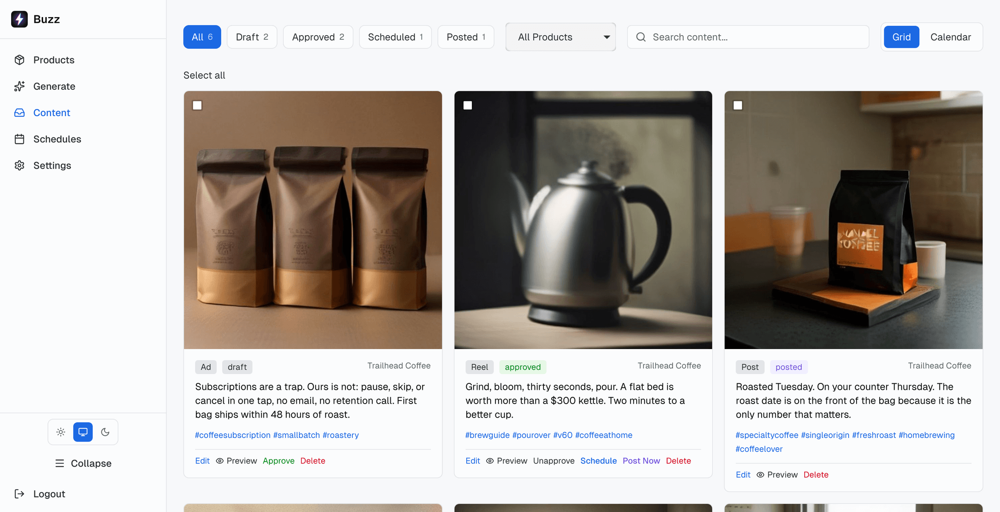
</p>

---

## Why Buzz

Most social tooling schedules posts you already wrote. Buzz writes them.

Drop in a product description (and optionally a marketing plan file, a logo, and app screenshots). Buzz extracts a structured **product profile** and **marketing strategy**, then uses that brain for everything downstream: hooks, content pillars, pain points, objections, brand voice, and visual direction. A rotation engine tracks what has already been used, so batch ten does not repeat batch one.

| | |
|---|---|
| **Runs on your machine** | One SQLite file, no SaaS, no per-seat billing |
| **Pluggable models** | Gemini, HuggingFace, or a local CLI model for text; Pollinations / Gemini / HuggingFace for images; Edge TTS + FFmpeg or Remotion for video |
| **Human in the loop** | Every draft lands in a queue, a calendar, or a Discord channel with Post / Edit / Delete buttons |
| **Ships to Instagram** | OAuth via Facebook Login, publishing through Meta Graph API |

---

## How it works

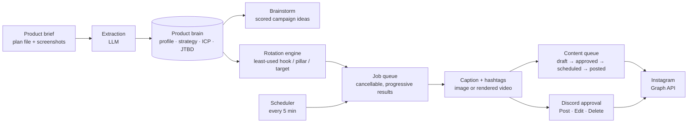

---

## Features

### Dashboard

Pipeline at a glance: counts per status, content distribution, per-product output, and recent activity. Light and dark themes throughout.

<p align="center">
  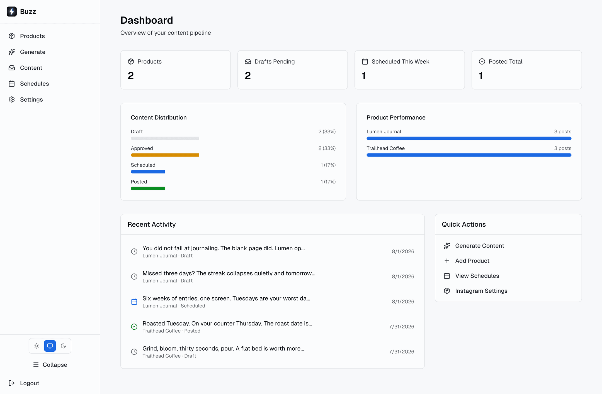
  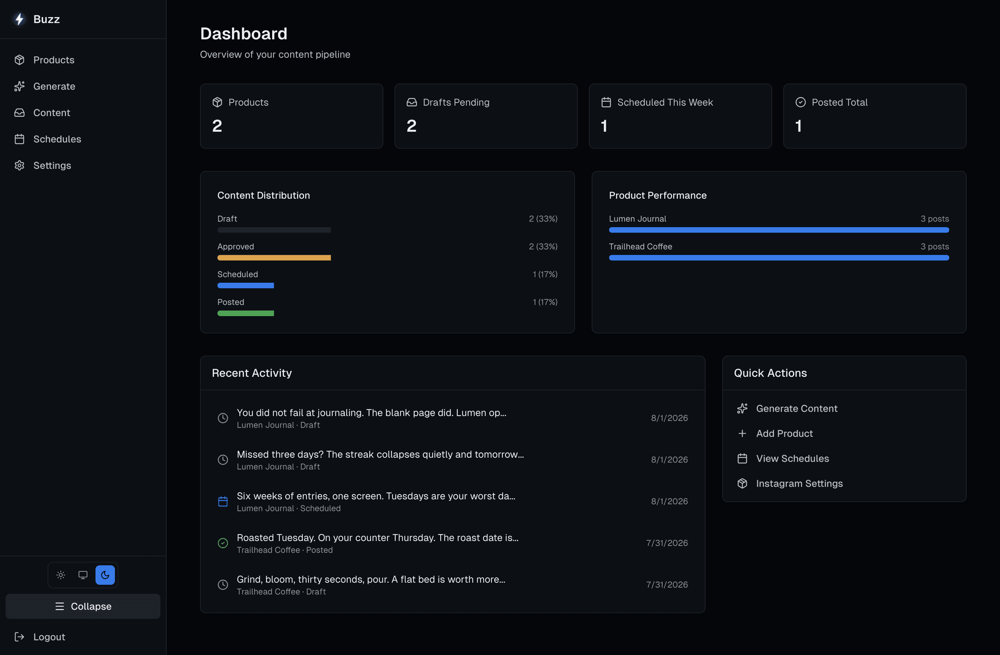
</p>

### Product brain

Add a product once. Buzz extracts a profile (value proposition, audience, tone, visual identity, differentiators, brand personality) and a marketing strategy (hooks, pillars, pain points, objections and counters, brand voice, CTA strategies), plus ICP and JTBD entries. Everything is editable inline, versioned, and revertible.

<p align="center">
  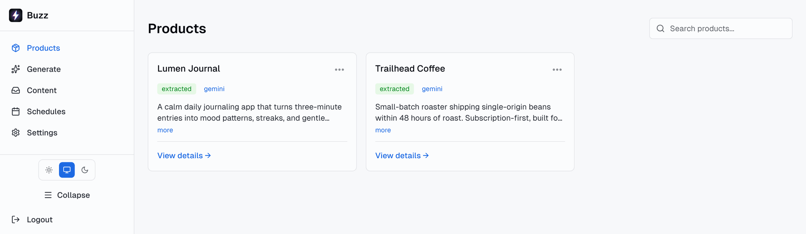
</p>

<p align="center">
  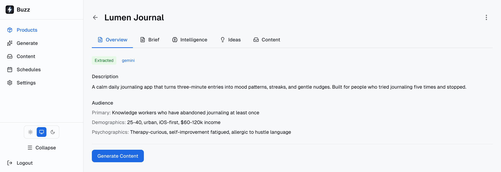
  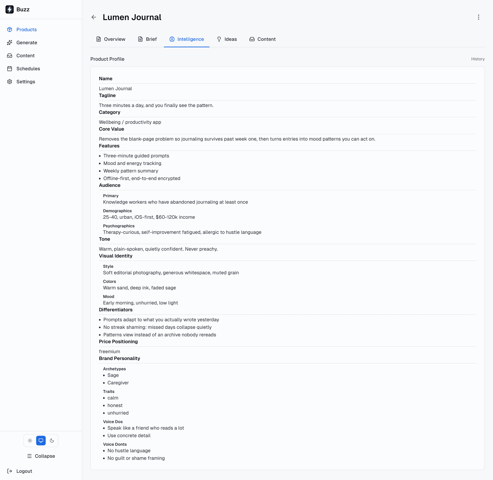
</p>

- Tabs per product: Overview, Brief, Intelligence, Ideas, Content
- Async extraction with live status: `pending`, `extracting`, `done`, `failed` (one-click retry, real failure reason)
- Revision history per field, with preview and revert
- Per-product overrides: text provider, image provider, video engine, custom LLM instructions, Instagram account

### Brainstorm

Ask for campaign ideas against the brain, optionally focused on a theme. Each idea comes back with a hook, why it works, a format, the riskiest assumption, and novelty / fit / feasibility scores, and is saved for later.

<p align="center">
  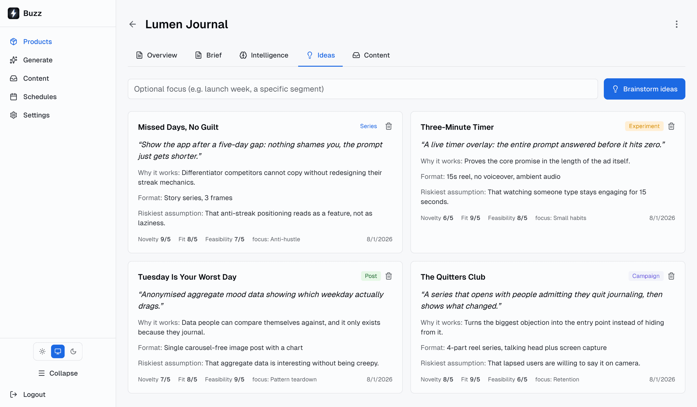
</p>

### Generation

Start from a preset or configure it yourself. Buzz suggests the least-used hook and content pillar, applies the brand's tone constraints and visual direction, and generates variations through a job queue: results stream in as each one finishes, and the batch stays cancellable.

<p align="center">
  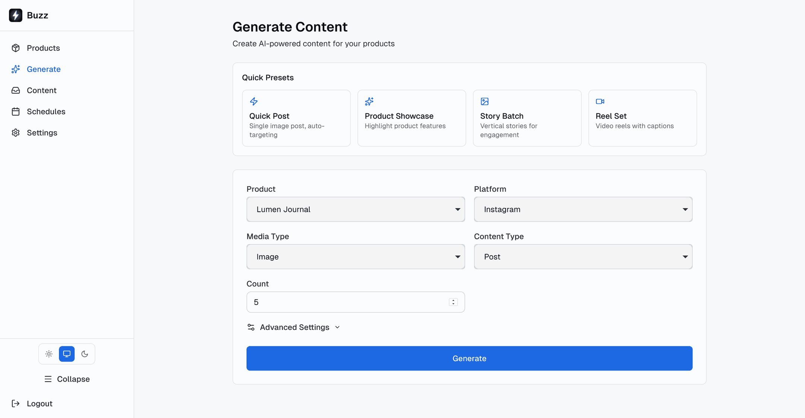
</p>

| Surface | Image | Video |
|---|---|---|
| Post | 1:1 | 1:1, 30s |
| Reel | not applicable | 9:16, 15s, captions on |
| Story | 9:16 | 9:16, 15s |
| Ad | 1:1 | 1:1, 15s, captions on |

Video renders through Remotion (headless Chrome, richer typography and transitions) with automatic fallback to the FFmpeg engine, using Edge TTS narration and SRT captions transcribed from the audio.

### Content queue

Filter by status, product, or free-text search. Bulk-select for batch actions. Switch between grid and a month calendar for scheduled posts, and check an Instagram phone preview before anything ships.

<p align="center">
  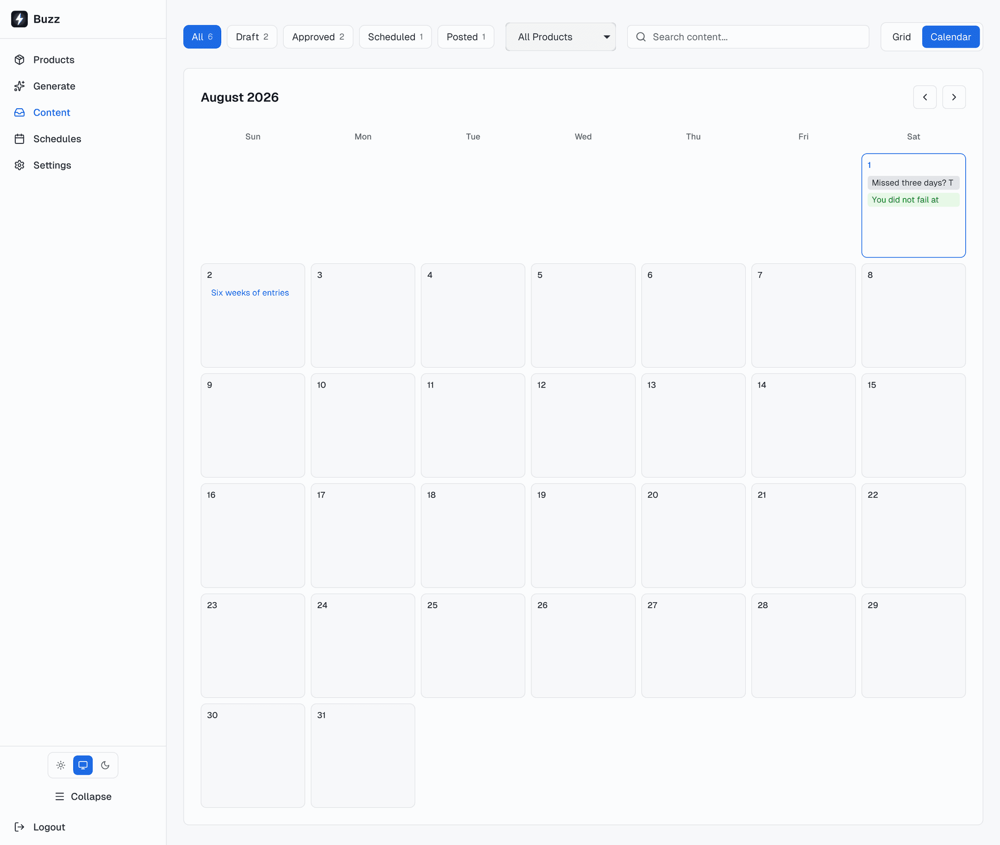
</p>

<p align="center">
  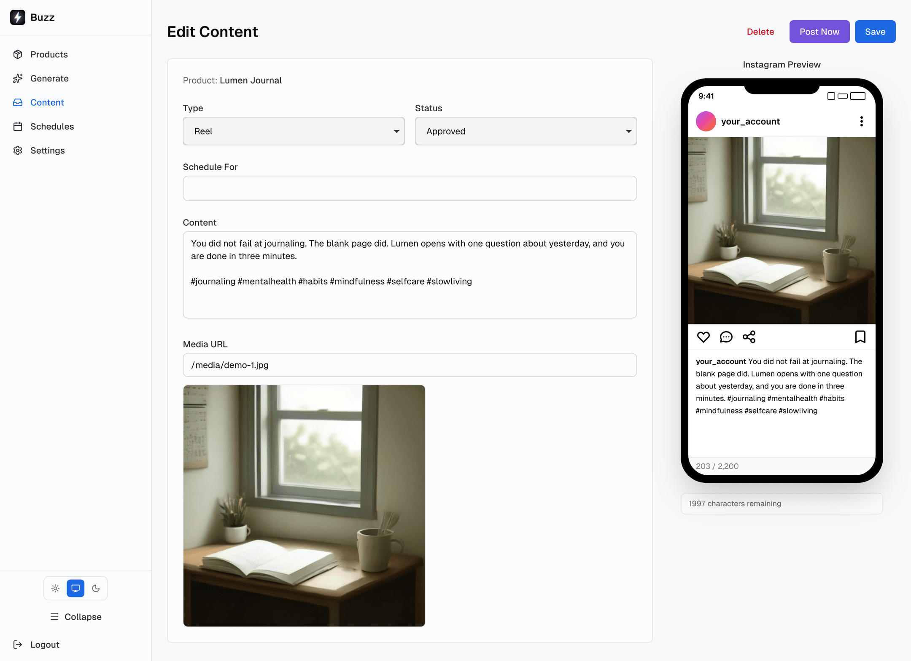
</p>

### Schedules and Discord approval

Per-product cadence (frequency, preferred time, surface, media type, count). An in-process worker runs every 5 minutes and anchors runs to the preferred time instead of drifting. Each generated draft is pushed to Discord with **Post**, **Edit**, and **Delete** buttons.

<p align="center">
  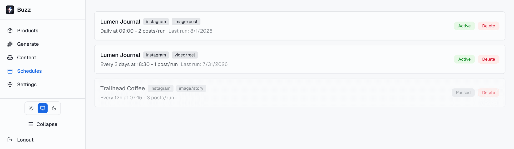
</p>

### Settings

Theme, default text provider, API keys (stored in the database, not in `.env`), default image provider and image style, default video engine, Instagram accounts, and Discord connection.

<p align="center">
  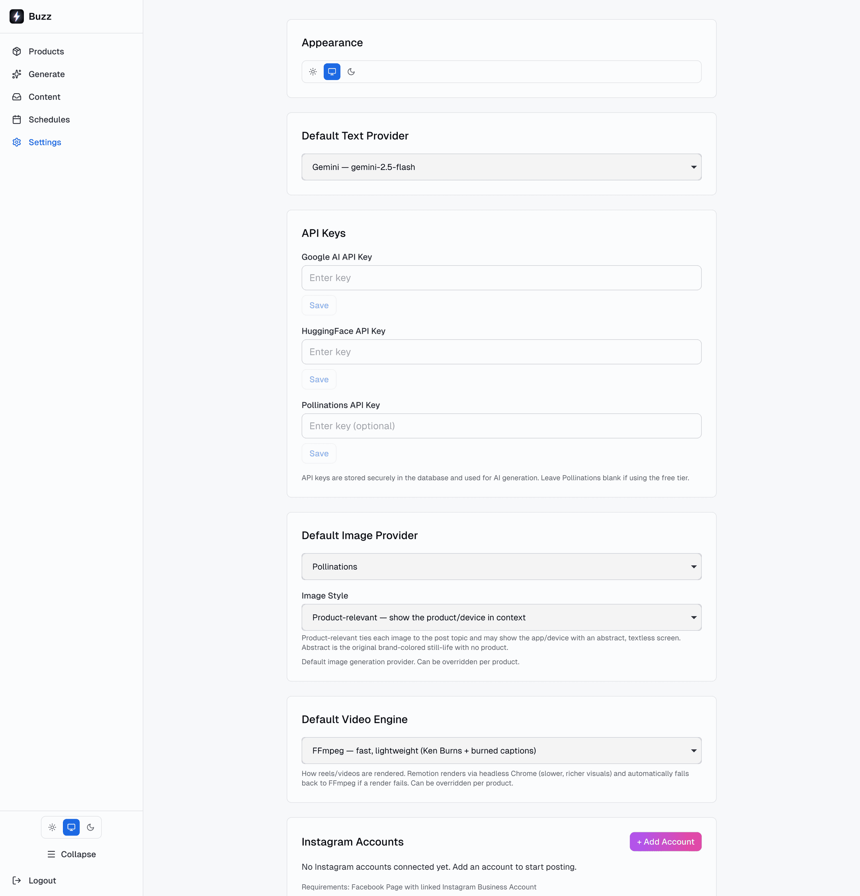
</p>

---

## Quick start

Requires **Node.js 20+** (better-sqlite3 and sharp build against it).

```bash
git clone https://github.com/lemmebee/buzz.git
cd buzz
npm install
cp .env.example .env      # fill in the values below
npm run db:push           # create data/buzz.db
npm run dev               # http://localhost:3000
```

Sign in with `ADMIN_PASSWORD`, add your AI keys under **Settings > API Keys**, create your first product at `/products/new`, and generate at `/generate`.

<p align="center">
  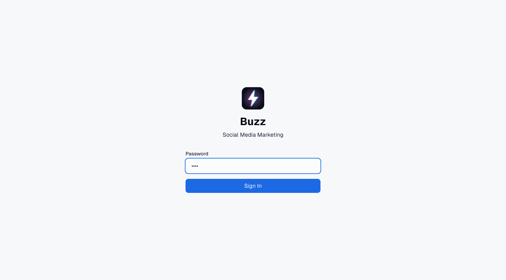
</p>

<details>
<summary><b>Install from a release tarball instead</b></summary>

```bash
curl -L https://github.com/lemmebee/buzz/archive/refs/tags/v0.1.0.tar.gz | tar -xz
cd buzz-0.1.0
npm install
cp .env.example .env
npm run db:push
npm run build
npm start
```

Or with `gh`:

```bash
gh release download v0.1.0 --repo lemmebee/buzz --archive=tar.gz
tar -xzf buzz-0.1.0.tar.gz && cd buzz-0.1.0
```

</details>

---

## Configuration

Model API keys live in the app (**Settings > API Keys**), so `.env` stays small:

| Variable | Required | Purpose |
|---|---|---|
| `ADMIN_PASSWORD` | yes | Single-user admin login |
| `TEXT_PROVIDER` | no | Default text provider when none is set in Settings (`gemini`, `huggingface`, `claude-code`, `antigravity`) |
| `FACEBOOK_APP_ID` | for posting | From developers.facebook.com |
| `FACEBOOK_APP_SECRET` | for posting | From developers.facebook.com |
| `INSTAGRAM_REDIRECT_URI` | for posting | OAuth callback, e.g. `http://localhost:3000/api/instagram/callback` |
| `CRON_SECRET` | for external cron | Protects `POST /api/cron/generate` |
| `ANTIGRAVITY_BIN` / `ANTIGRAVITY_MODEL` | no | Path and model for the local `agy` CLI text provider |
| `GOOGLE_CLOUD_PROJECT_ID` | no | Enables Cloud Console usage links for your Gemini key |

Google AI, HuggingFace, and Pollinations keys are entered in Settings. Discord credentials (bot token, public key, channel ID) are entered in Settings too, not in `.env`.

---

## Setup guides

<details>
<summary><b>Instagram publishing</b></summary>

1. Create an app at [developers.facebook.com](https://developers.facebook.com).
2. Add the Instagram Graph API product.
3. Create a Facebook Page and link an Instagram Business Account to it.
4. Add your OAuth redirect URI to the app settings.
5. Connect the account from the Buzz **Settings** page, then link it to a product from the product menu.

Buzz exchanges the short-lived token for a long-lived one (60-day expiry) and publishes through the Meta Graph API.

</details>

<details>
<summary><b>Discord approval flow</b></summary>

Scheduled runs post each draft to a Discord channel with **Post**, **Edit**, and **Delete** buttons. Post publishes to Instagram, Edit opens a modal to rewrite the caption, Delete drops the draft.

**One-time bot setup**

1. Create a personal Discord server (any server you control works).
2. Go to [discord.com/developers/applications](https://discord.com/developers/applications), click **New Application**, name it.
3. **Bot** tab, **Reset Token**, copy the token.
4. **General Information** tab, copy the **Public Key** (64 hex chars).
5. **OAuth2 > URL Generator**, scope `bot`, permissions `Send Messages` and `Embed Links`, open the generated URL, invite the bot to your server.
6. In the Discord client: User Settings > Advanced > enable Developer Mode. Right-click the target channel, **Copy Channel ID**.
7. In Buzz, open **Settings**, find the Discord card, paste the bot token, public key, and channel ID, then connect. A test message lands in the channel.

**Public URL for button clicks**

Discord button presses POST to your app, so localhost is not reachable. You need a stable public HTTPS URL.

Recommended: [Tailscale Funnel](https://tailscale.com/kb/1223/funnel) (free, stable hostname, survives reboots):

```bash
curl -fsSL https://tailscale.com/install.sh | sh
sudo tailscale up
sudo tailscale set --operator=$USER
tailscale funnel --bg 3000
```

Enable HTTPS and MagicDNS in the [Tailscale DNS panel](https://login.tailscale.com/admin/dns), and grant `funnel` via `nodeAttrs` in [access controls](https://login.tailscale.com/admin/acls/file). `tailscale funnel status` prints the public URL (for example `https://<machine>.<tailnet>.ts.net`).

Then in the Discord dev portal, **General Information**, set the **Interactions Endpoint URL** to:

```
https://<your-funnel-host>/api/discord/interactions
```

Discord verifies the URL with a signed PING, so the save succeeds once Buzz is reachable and the public key is configured. The hostname is stable, so this is a one-time step.

Alternatives: Cloudflare named tunnel, paid ngrok, or any HTTPS reverse proxy on a VPS.

</details>

<details>
<summary><b>Scheduling</b></summary>

- `/schedules` sets per-product cadence: frequency in hours, preferred time, surface, media type, and count.
- The worker runs every 5 minutes in-process (`src/lib/worker.ts`, started by `src/instrumentation.ts`) and anchors each run to the preferred time so runs do not drift later every day.
- Each due schedule generates drafts and ships them to Discord for approval.
- External cron alternative: `POST /api/cron/generate` with header `x-cron-secret: $CRON_SECRET`.

</details>

<details>
<summary><b>Monitoring Gemini usage in your own timezone</b></summary>

[Google AI Studio Usage](https://aistudio.google.com/usage) charts are hardcoded to UTC-8 with no timezone toggle, which makes correlating bars with scheduler runs painful.

For the same data with a timezone selector, use Cloud Console:

```
https://console.cloud.google.com/apis/api/generativelanguage.googleapis.com/metrics?project=$GOOGLE_CLOUD_PROJECT_ID
```

Set `GOOGLE_CLOUD_PROJECT_ID` in `.env` to the project that owns your Google AI key (it is visible in the AI Studio URL as `project=gen-lang-client-XXXX`). Each chart has a timezone control in its top-right menu.

</details>

<details>
<summary><b>Running it as a service (Linux)</b></summary>

PM2, using the checked-in `ecosystem.config.js` (production build, its own `.env.prod`):

```bash
npm run build
pm2 start ecosystem.config.js
pm2 logs buzz-prod
pm2 save
```

Or a systemd user unit at `~/.config/systemd/user/buzz.service` running `npm start`:

```bash
systemctl --user start  buzz.service
systemctl --user enable buzz.service
journalctl --user -u buzz.service -f
```

Expose it with Tailscale Funnel or a Cloudflare tunnel; both keep a stable public hostname across reboots.

</details>

---

## Architecture

```
src/
  app/                 Next.js App Router pages + API routes
    api/               products, posts, generate, jobs, schedules, instagram, discord, cron, settings
  components/          AppShell, Sidebar, ContentCard, ContentCalendar, InstagramPhonePreview, ...
  lib/
    brain/             extraction prompts, parser, rotation engine, brainstorm types
    providers/         gemini, huggingface, claude-code, antigravity, pollinations, remotion, ffmpeg, tts
    image/             image spec authoring + render orchestration
    video/             scene orchestration, render spec, ffmpeg composition
    skills/            reusable prompt packs (creative director, ad creative, social content)
    jobQueue.ts        cancellable generation jobs with incremental results
    scheduler.ts       due-schedule computation anchored to preferred time
    worker.ts          in-process 5-minute loop
    instagram.ts       Graph API publishing + token lifecycle
    discord.ts         draft embeds, buttons, modal interactions
  remotion/            Remotion compositions for video and image rendering
drizzle/               schema + migrations
```

**Stack:** Next.js 14 (App Router), TypeScript, SQLite via Drizzle ORM, Tailwind CSS, Remotion, sharp, ffmpeg-static, msedge-tts, zod.

**Data model:** `products`, `content`, `product_revisions`, `generation_schedules`, `brainstorm_ideas`, `jobs`, `instagram_accounts`, `settings`.

---

## Scripts

| Command | What it does |
|---|---|
| `npm run dev` | Dev server on :3000 |
| `npm run build` / `npm start` | Production build and serve |
| `npm run lint` | ESLint (Next.js config) |
| `npm run db:push` | Push schema to SQLite |
| `npm run db:generate` | Generate a migration from schema changes |
| `npm run db:migrate` | Apply migrations |
| `npm run db:studio` | Drizzle Studio |
| `npm run db:seed` | Seed a sample product |
| `npm run test:provider` | Smoke-test the configured text provider |
| `npm run test:buzz` | End-to-end generation flow check |
| `npm run test:remotion` | Render a Remotion video without the app |
| `npm run test:insta` | Instagram publishing check |

---

## License

MIT, see [LICENSE](LICENSE).
