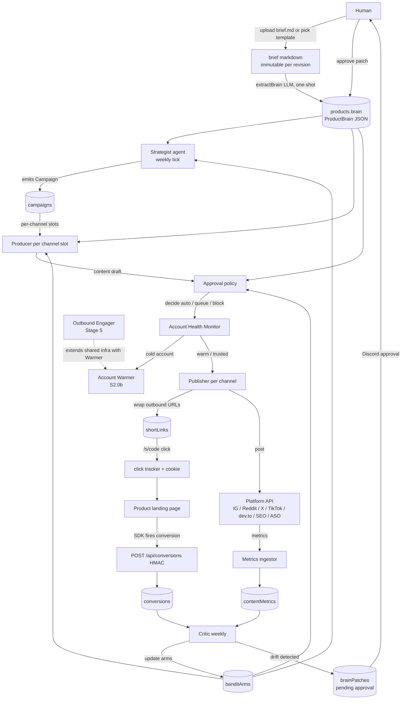
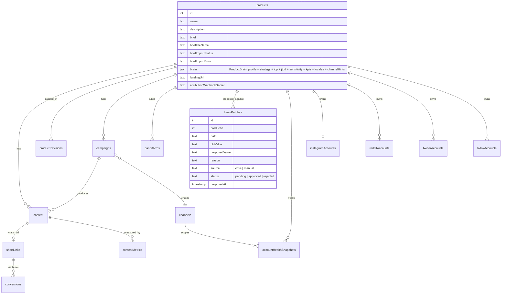
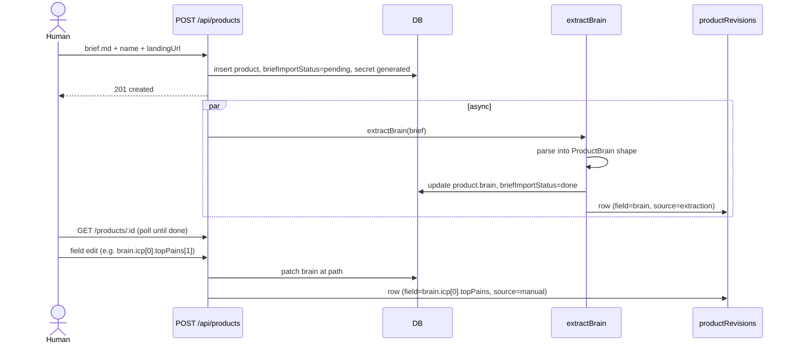
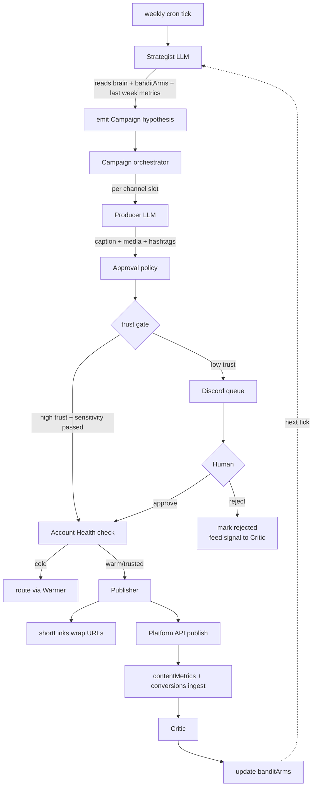
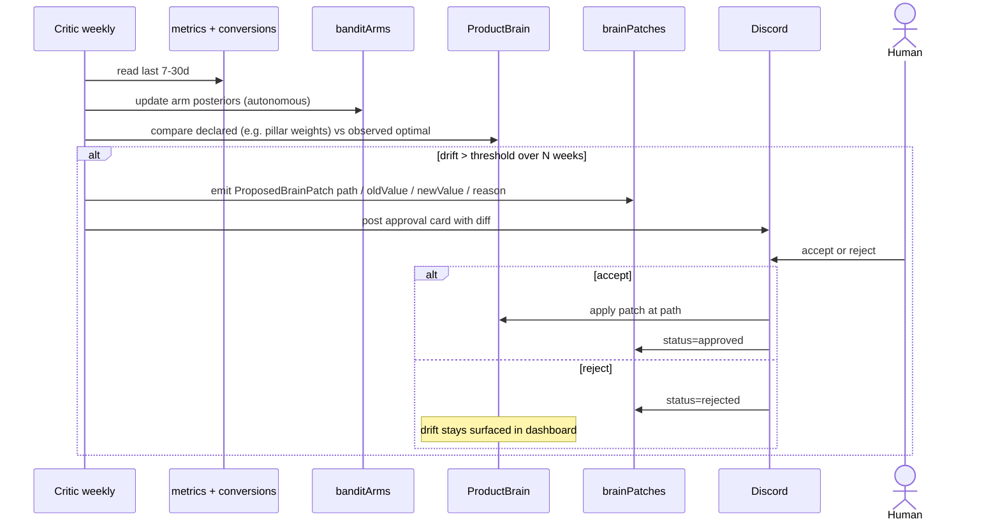

# Autonomous Marketing Plan (Path A)

> Source-of-truth for the multi-stage rebuild of Buzz from "AI content generator" into "autonomous marketing platform for software."
>
> Supersedes parts of [PLAN.md](./PLAN.md). The original `PLAN.md` stays for historical context but its priority tiers are obsolete.

## Goal

Make Buzz handle marketing for software over social media with minimal human intervention, where success = **real users using the marketed apps** (installs / signups / activations), not vanity metrics.

## Architecture (3 layers)

```
Layer 1: STRATEGY        who buy, why, where they hang, what message
Layer 2: PRODUCTION      make channel-native content
Layer 3: DISTRIBUTION    reach, engagement, attribution, learning
```

Buzz today only attempts layer 2. Skip 1 + 3 = posting-into-void forever (representative test product's IG: 42 posts, 1 follower despite weeks of generation).

## What Buzz already has (real foundation)

| Layer | Status | File |
|---|---|---|
| Product brain schema | Strong - ICP-ish via `ProductProfile.audience` + `customerSegments` + `differentiators` + `competitorContext` | `src/lib/brain/types.ts` |
| Strategy schema | Strong - categorized hooks, content pillars, pain/desire/objections, brand voice, CTA strategies | `src/lib/brain/types.ts` |
| Content rotation | Random-weighted picker over hooks/pillars/targets | `src/lib/brain/rotation.ts` |
| Provider abstraction | text/image/video/audio swappable | `src/lib/providers/` |
| Scheduler | Cron-style, per-product, per-platform field | `src/lib/scheduler.ts` |
| Publisher | IG Graph API working, Twitter referenced in enum but unbuilt | `src/lib/instagram.ts` |
| Revisions | Audit trail on profile/strategy changes | `productRevisions` table |
| Video pipeline | TTS + scenes + captions live (commit 326bd50) | `src/lib/video/` |
| Approval gate | Discord interaction routes hint at this | `src/app/api/discord/` |

## Gap to Path A

| Capability | Status | Severity |
|---|---|---|
| Strategist (channel/cadence/thesis decisions) | Missing - schedules built manually in UI | Critical |
| Multi-channel publishers (Reddit, X, HN, PH, dev.to, TikTok, SEO, ASO) | Only IG real | Critical |
| Attribution (short-links + install webhooks) | Zero | Critical - **blind without** |
| Platform metrics ingestion | Zero | Critical |
| Critic/learner (perf → rotation weights) | Rotation is random, no feedback loop | Critical |
| Campaign concept (goal + phase + hypothesis) | Schedules != campaigns | High |
| Launch sequencer (day-N playbook) | Missing | High |
| Audience research / ICP enrichment | Manual at product creation | Medium |
| Outbound engager (comments, replies) | Missing | Medium - high ban risk, build last |
| Account-health monitor + warmer | Missing | **Critical** - publishers post into void without warm accounts. Added after #38 review by @m13v. See #72, #73 |
| Multi-ICP / sensitivity rules / locales / pillar weights / KPIs in product schema | S0.1 covers single-shape only | **Critical** - real briefs have multiple ICPs, multiple locales, weighted pillars, hard sensitivity constraints. See #75 |
| Approval policy (auto-approve high-trust templates) | Manual approval today | Medium |

## Refined design (v2)

After review pass:

- **Rename** `planFile` → `brief` (industry-standard term; single chore migration to file + grep-replace across schema/types/UI)
- **Brief as onboarding artifact only.** Markdown brief parsed once via `extractBrain(brief) -> ProductBrain`. Brief kept as immutable historical record in `productRevisions`. NOT consulted at runtime.
- **`ProductBrain` = single typed JSON** holding everything: profile, strategy (with weighted pillars), ICP[], JTBD[], sensitivity rules, KPI targets, channel hints, locales (locales fold into profile/strategy via `byLocale` keys; no separate `productLocales` table). Stored in `products.brain` JSON column.
- **One-way truth**: `brief -> brain` via extraction. Field edits go directly to `brain` via form UI (no markdown round-trip).
- **`extractBrain(productId)` = single function** (not per-section). Runs only on initial import or explicit re-import.
- **Section addressability dropped.** Indexes ARE the queryable view; no need to re-address brief sections at runtime.
- **Sensitivity rules injected as prompt prefix** in Strategist + Producer + Approval gate (NOT Critic - it doesn't generate user-facing content). Single chokepoint: `buildSystemPrompt(productId, audience)`.
- **Critic loop closed via `brainPatches`.** Critic does TWO things autonomously: (1) updates `banditArms` posteriors instant; (2) detects drift between declared brain intent (e.g. pillar weights) vs observed reality. Sustained drift -> emits `ProposedBrainPatch` (structured: path + oldValue + newValue + reason) -> Discord approval -> on accept applies patch + logs revision. Brief markdown is never auto-rewritten. Indices update only via human-gated patch flow.

## System architecture



## Data model



## Onboarding sequence



## Runtime cycle



## Critic loop with brain patches



## Stages

Detailed backlog lives in GitHub issues + milestones. Stage = milestone, ~6-week macro phases collapse to:

| Stage | Milestone | Issues | Weeks | Goal |
|---|---|---|---|---|
| 0 | Product brain augmentation | 4 (#22-24, #75) | 1 | ICP/JTBD/channelHints schema + multi-ICP/sensitivity/locales/weights extension + UI + LLM draft |
| 1 | Attribution + Critic on IG | 12 (#21, #25-35) | 3 | Close measurement loop on existing IG before scaling |
| 2 | Multi-channel + Strategist v1 | 12 (#36-45, #72, #73) | 5 | Account health gate + warmer, Reddit, X, SEO blog, ASO + cross-channel allocator |
| 3 | Launch motion + Approval policy | 6 (#46-51) | 2 | Day-N launch playbook + trust-scored auto-approve |
| 4 | TikTok/Reels + dev.to/IH | 7 (#52-58) | 3 | Higher-reach channels using video pipeline |
| 5 | Outbound engager | 6 (#59-64) | 2 | Subreddit/X watchers + value-add replies (highest ban risk - last) |
| 6 | Paid amplification | 4 (#65-68) | 2 | Meta/Google Ads + unified CAC |

**Critical path**: S0.1 -> **S0.1a (#75)** -> S1.1 -> S1.2 -> S1.5 -> S1.7 -> S1.9 -> S2.1 -> **S2.0 (#72)** -> **S2.0b (#73)** -> publishers. Everything else fans out from these. S0.1a extends schema for multi-ICP / sensitivity rules / locales / pillar weights / KPIs after a real product brief exposed S0.1's single-shape assumptions. Account-health monitor + warmer are non-skippable prereqs for all Stage 2 publish work after #38 review by @m13v.

Project board: https://github.com/users/lemmebee/projects/1/views/1

## Locked decisions

| # | Question | Decision |
|---|---|---|
| Q1 | Short-link domain | Deferred. Buzz local until proven worthy. Build against `localhost:3000/s/...`; env var `BUZZ_PUBLIC_URL` swap-able later |
| Q2 | Install attribution | JS snippet on the test product's landing page. Events: `visit`, `signup`, `activate`. HMAC SHA-256 + timestamp + nonce. App Store / Play install referrer deferred to Stage 2 ASO |
| Q3 | LLM budget | **Free tier only. No paid LLM.** Per-product cap 50 LLM calls/day. Fallback chain: gemini-2.0-flash -> gemini-1.5-flash -> huggingface |
| Q4 | Approval gate | Discord-only for v1 (existing plumbing). In-app queue only if >20 pending at any time |
| Q5 | Hosting | Local until Buzz proves worthy. CodeRabbit + CI run on GitHub regardless |
| Q6 | First test product | Web product with signup + real attribution target (held privately; not named in public artifacts) |
| Q7 | Repo public/private | **Public** (flipped from private after CodeRabbit pricing showed $30/seat/mo for private). Buzz core open-source. When Stage 5 (engager) lands, split into separate private repo OR ship as opt-in module. Free CodeRabbit Pro + free branch protection are the prize |

## Channel selection logic (Strategist must implement)

Strategist picks channel per product from product profile, not by default. Hardcoding is forbidden.

Channel mix depends entirely on per-product profile. Examples:
- Dev tool: X + r/programming + HN + dev.to
- Visual consumer app: IG + TikTok
- B2B SaaS: SEO blog + LinkedIn + cold email
- Niche-community consumer app: TikTok + relevant subreddits + niche IG accounts

Build modules in order of **capability coverage**, not channel preference:
- Channels where attribution actually work (deep link / referrer trackable)
- Channels with lowest automation-ban risk (so v1 doesn't die week 2)
- Channels that cover broadest ICP variety across future products

Early modules: Reddit, X, SEO blog, ASO. Late modules: TikTok, IG Reels, comment engagers, paid ads.

## Risks (explicit)

| Risk | Mitigation |
|---|---|
| Platform ToS / bans | Per-channel post:engage:lurk ratio policy. Engager last. Rate-limit aggressive. Safety dashboard (S5.6) |
| LLM cost runaway | Free tier only; 50/day/product cap; fallback chain |
| Attribution dark patterns | Per-channel attribution mode in registry; some platforms strip links - branch on attributionMode |
| Discord gate scaling | Trust auto-approval threshold tunes itself (S3.4 + S3.6) - not static |
| Single-product test | One product = one data point. Validate architecture but expect channel mix to shift for next products |
| Buzz instance offline | Stage 1-3 = local-only. Cron + webhook reliability constrained to user's machine uptime. Move to Railway/Fly at Stage 4+ |
| Free-tier rate limits | Project-wide Gemini RPD ceiling (1500/day) caps fleet of products to ~10 actively-served |
| Engager code public | Stage 5 engager must split to private repo OR opt-in plugin BEFORE merging to public Buzz |
| Cold-account auto-ban | Every publisher consults Account Health Monitor (#72) before posting; cold accounts route through Warmer (#73) until trust threshold met. Insight from @m13v on #38 |

## What human must still do (be honest about "minimal")

| Task | Auto | Human |
|---|---|---|
| Fill ICP/JTBD per product (once) | LLM draft (S0.3) | Refine (~30min one-time) |
| Hand over platform tokens | n/a | One-time per channel |
| Strategist weekly decisions | yes | Review week 1-4, then yes |
| Content gen | yes | n/a |
| Approval | trust-gated auto | Low-trust queued to Discord |
| Posting | yes | n/a |
| Metrics ingest | yes | n/a |
| Critic | yes | n/a |
| Kill bad campaign | auto if CAC > N or trust drops | Manual override |
| Real DMs from interested humans | draft only | Send |
| Pay for ads | n/a | Yes (Stage 6 only) |

Realistic steady-state: **30 min/wk after Stage 3**, plus 1 hr per new product onboarded.

## Open items (not blocking, decide later)

- Per-product custom domain for short-links (white-label phase)
- Multi-tenant Buzz (Buzz as a service, not just personal tool) - out of scope until ROI proven
- Switch SQLite -> Postgres for prod multi-tenant - track as separate epic
- Paid LLM budget unlock criteria - revisit after Stage 1 results
